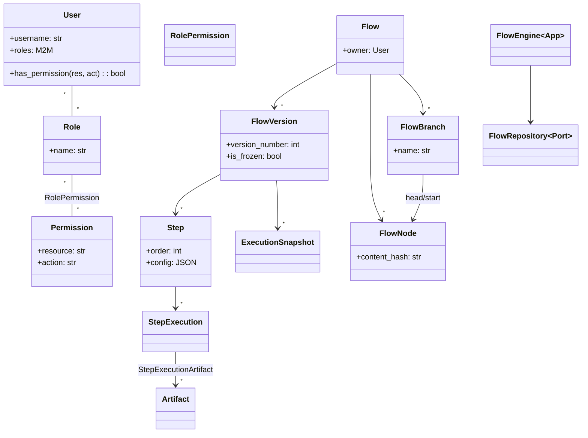
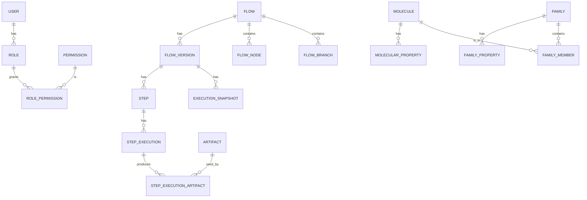
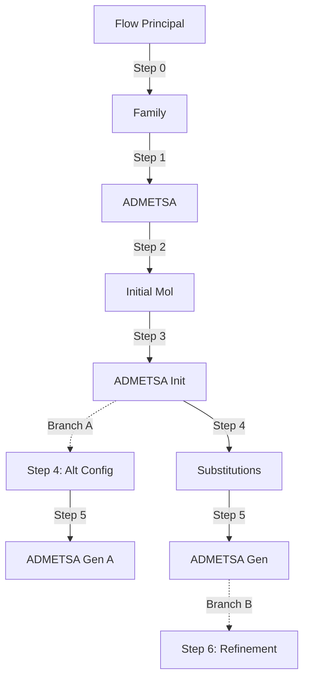
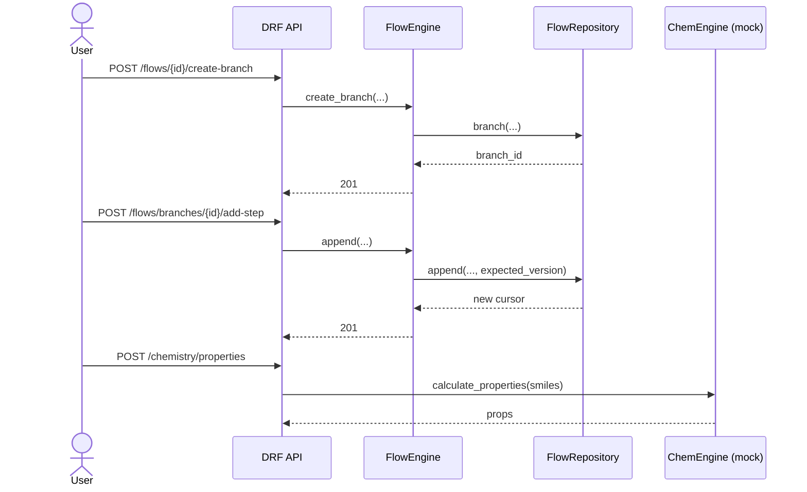

# ChemFlow Backend (Django + DRF)

Backend modular con arquitectura hexagonal y principios SOLID para gestión de usuarios, flujos versionados/ramificados y dominio químico (moléculas y propiedades), con notificaciones por puertos/adaptadores.

- Users: autenticación JWT, RBAC (roles/permissions), tokens
- Flows: workflows step-first, versiones, artefactos, árbol sin merges
- Chemistry: moléculas, propiedades (EAV), familias y relaciones
- Notifications: email/webhook/realtime (mocks incluidos)

## Arquitectura Hexagonal (Ports & Adapters)

- Dominio: entidades y reglas de negocio puras (sin framework)
- Aplicación: orquesta casos de uso (servicios/engines)
- Infraestructura: Django ORM/DRF, adaptadores email/webhook/realtime
- Interfaces: HTTP ViewSets/Serializers

Principios SOLID:

- SRP: clases con responsabilidad única (admin por modelo, servicio por caso de uso)
- OCP/DIP: puertos (`interfaces/protocols`) + adaptadores; DI container en notifications

## Diagrama de Clases (simplificado)



## Diagrama de Base de Datos (ER, alto nivel)



## Diagrama de Flujo (Branching y Versionado)



## Diagrama de Secuencia (Ejecución de Workflow)



## Setup rápido

Requisitos: Python 3.11+, pip, virtualenv (opcional)

```bash
python3 -m venv .venv
source .venv/bin/activate
pip install -r backend/requirements.txt
python backend/manage.py migrate
python backend/manage.py seed_all
python backend/manage.py runserver 127.0.0.1:8000
```

Swagger/OpenAPI:

- Esquema: `GET /api/schema/`
- Swagger UI: `GET /api/docs/swagger/`
- Redoc: `GET /api/docs/redoc/`

## Autenticación

- Login: `POST /api/token/` (username/password) → `{ access, refresh, user }`
- Refresh: `POST /api/token/refresh/` → `{ access }`
- Header: `Authorization: Bearer <access>`

Roles y permisos (RBAC): ver endpoints `api/users/roles/`, `api/users/permissions/`.

## Flows (árbol sin merges)

- Endpoints principales bajo `/api/flows/`:
  - `flows/` CRUD de flujos; `flows/{id}/mine/` y `?mine=true`
  - `versions/` CRUD + `versions/{id}/execute/` y `versions/{id}/freeze/`
  - `branches/` CRUD + `branches/{id}/add-step/` y `flows/{id}/create-branch/`
  - `nodes/` read-only (deduplicación por `content_hash`)
  - `executions/` y `step-executions/` (SSE para logs)

### Demo “CADMA-like” (dummy end-to-end)

Ejecuta un flujo de 6 pasos con branching y snapshot usando repositorio en memoria:

```bash
python backend/manage.py demo_cadma_flow
```

Salida esperada: ids/cursors de pasos, nombre de rama creada y snapshot con cursor final.

## Tests

```bash
pytest -q backend
```

## Notas de seguridad (producción)

- Configurar `SECRET_KEY` fuerte, `DEBUG=False`, `ALLOWED_HOSTS`, `SECURE_*` cookies, HSTS y SSL redirect.
- Revisa `back/settings.py` y las advertencias de `manage.py check --deploy`.

## Contribución / Roadmap

- Implementar `DjangoFlowRepository` para persistir `FlowData` (event sourcing) en DB.
- Integración RDKit real detrás de `ChemEngineInterface`.
- WebSocket backend para realtime (reemplazar mock SSE si se desea).

- LSP: sustitución segura de adaptadores que implementan el mismo puerto
- ISP: interfaces pequeñas (IEmailSender, IWebhookSender, IRealtimeSender)
- DIP: dominio depende de puertos, adaptadores dependen de puertos

Bounded Contexts

- users/: User, Role, Permission, UserToken, auth JWT
- flows/: Flow, FlowVersion, Step, Artifact, Execution, árbol (FlowNode/Branch)
- chemistry/: Molecule, Family, propiedades (EAV)
- notifications/: domain, application, infrastructure

Estándares de código

- Tipado: mypy + django-stubs (mypy.ini configurado)
- Estilo: flake8 (max 100 chars), docstrings claras
- Serializers: validación explícita, read_only_fields definidos
- Permisos: permiso por recurso/acción (users.permissions.HasAppPermission)
- Servicios: lógica de negocio en services.py (no en views)
- Migraciones: determinísticas, sin side-effects salvo migraciones de datos con reversa

Ejecución local

1. Instalar dependencias (Python 3.12):

```bash
pip install -r backend/requirements.txt
```

1. Migraciones:

```bash
python backend/manage.py migrate
```

1. Crear datos de ejemplo (opcional):

```bash
python backend/manage.py seed_roles
python backend/manage.py seed_users
python backend/manage.py seed_molecules
python backend/manage.py seed_flows
```

1. Ejecutar servidor:

```bash
python backend/manage.py runserver
```

1. Tests:

```bash
pytest -q
```

Puntos de extensión

- Notificaciones: reemplace mocks por adaptadores reales (SMTP, Channels)
- Artefactos: cambie storage_path a almacenamiento S3/GCS mediante repositorio
- Árbol de flujos: políticas de validación y control de concurrencia

Convenciones de permisos

Resource:Action

- users: read/write/delete
- flows: read/write/execute/delete
- chemistry: read/write/delete

Checklist de calidad

- Build: Django check/migrate PASS
- Lint: flake8 sin errores de estilo críticos
- Types: mypy sin errores en módulos de dominio/aplicación
- Tests: unitarios mínimos por bounded context
