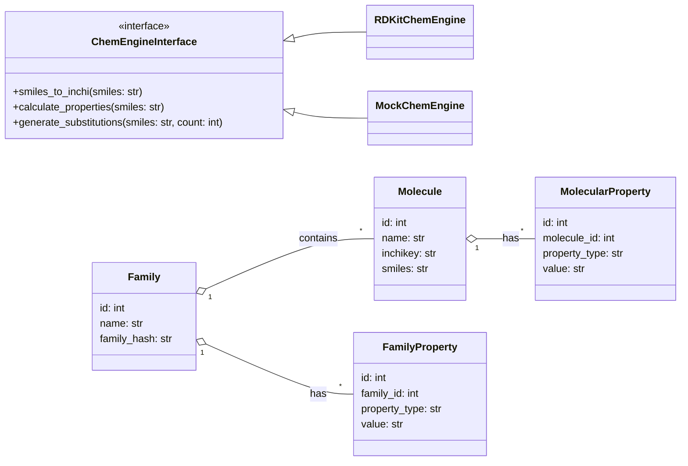
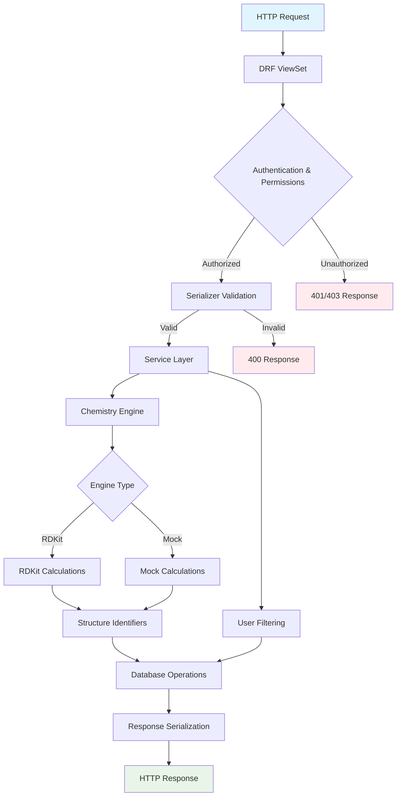

# Chemistry Module

El módulo Chemistry implementa un sistema completo de gestión de moléculas y familias químicas con arquitectura hexagonal, tipado fuerte y principios SOLID.

## 📋 Tabla de Contenidos

- [Arquitectura](#️-arquitectura)
- [Diagramas](#-diagramas)
- [Configuración](#️-configuración)
- [Modelos de Datos](#️-modelos-de-datos)
- [Endpoints API](#-endpoints-api)
- [Uso desde Otros Módulos](#-uso-desde-otros-módulos)
- [Tipos de Datos](#-tipos-de-datos)
- [Proveedores](#-proveedores)
- [Testing](#-testing)

## 🏗️ Arquitectura

El módulo sigue arquitectura hexagonal con separación clara de responsabilidades:

```text
chemistry/
├── types.py           # Tipos centralizados (dataclasses, TypedDict)
├── providers/         # Adaptadores para motores químicos
│   ├── interface.py   # Interfaz común
│   ├── rdkit_chem.py  # Implementación RDKit
│   └── mock_chem.py   # Mock para testing
├── services.py        # Lógica de dominio/aplicación
├── views.py          # Adaptadores HTTP (DRF ViewSets)
├── serializers.py    # Validación y transformación de datos
├── models.py         # Entidades de persistencia
└── README.md         # Este archivo
```

### Principios Aplicados

- **SRP (Single Responsibility)**: Cada módulo tiene una responsabilidad específica
- **OCP (Open/Closed)**: Extensible vía nuevos providers sin modificar código existente
- **DIP (Dependency Inversion)**: Dependencias hacia abstracciones (interfaces)
- **Hexagonal**: Lógica de negocio independiente de frameworks externos

## 📊 Diagramas

### Diagrama de Clases



### Diagrama de Flujo de Funcionamiento



## ⚙️ Configuración

### Variables de Entorno

```python
# settings.py
CHEM_ENGINE = os.environ.get('CHEM_ENGINE', 'rdkit')  # 'rdkit' o 'mock'
```

### Selección de Motor Químico

El sistema selecciona automáticamente el motor apropiado:

```python
# chemistry/providers/__init__.py
if CHEM_ENGINE == "mock":
    from .mock_chem import mock_engine as engine
else:
    try:
        from .rdkit_chem import engine
    except ImportError:
        from .mock_chem import mock_engine as engine
```

## 🗄️ Modelos de Datos

### Molecule

Entidad molecular con identificadores invariantes y metadatos flexibles.

**Campos clave:**

- `inchikey`: Identificador único (27 caracteres)
- `smiles`, `canonical_smiles`: Notaciones estructurales
- `molecular_formula`: Fórmula química
- `metadata`: Datos flexibles (JSON)

### Family

Agregación de moléculas relacionadas.

**Campos clave:**

- `family_hash`: Hash único basado en SMILES de miembros
- `provenance`: Origen de la familia (user, substitutions, etc.)
- `frozen`: Estado inmutable

### MolecularProperty / FamilyProperty

Modelo EAV (Entity-Attribute-Value) para propiedades flexibles.

**Campos contextuales:**

- `method`: Método de cálculo/determinación
- `units`: Unidades de medida
- `source_id`: Referencia externa
- `relation`: Tipo de relación con la entidad

## 🌐 Endpoints API

### Moléculas

| Método    | Endpoint                                      | Descripción           |
| --------- | --------------------------------------------- | --------------------- |
| GET       | `/api/chemistry/molecules/`                   | Listar moléculas      |
| POST      | `/api/chemistry/molecules/`                   | Crear molécula        |
| GET       | `/api/chemistry/molecules/{id}/`              | Obtener molécula      |
| PUT/PATCH | `/api/chemistry/molecules/{id}/`              | Actualizar molécula   |
| DELETE    | `/api/chemistry/molecules/{id}/`              | Eliminar molécula     |
| GET       | `/api/chemistry/molecules/mine/`              | Moléculas del usuario |
| POST      | `/api/chemistry/molecules/from_smiles/`       | Crear desde SMILES    |
| POST      | `/api/chemistry/molecules/{id}/add_property/` | Agregar propiedad     |

#### Ejemplo: Crear molécula desde SMILES

```bash
curl -X POST /api/chemistry/molecules/from_smiles/ \
  -H "Content-Type: application/json" \
  -H "Authorization: Bearer <token>" \
  -d '{
    "smiles": "CCO",
    "name": "Etanol",
    "extra_metadata": {"common_name": "ethanol"}
  }'
```

**Respuesta:**

```json
{
  "id": 1,
  "name": "Etanol",
  "smiles": "CCO",
  "canonical_smiles": "CCO",
  "inchikey": "LFQSCWFLJHTTHZ-UHFFFAOYSA-N",
  "molecular_formula": "C2H6O",
  "structure_identifiers": {
    "inchi": "InChI=1S/C2H6O/c1-2-3/h3H,2H2,1H3",
    "inchikey": "LFQSCWFLJHTTHZ-UHFFFAOYSA-N",
    "canonical_smiles": "CCO",
    "molecular_formula": "C2H6O"
  },
  "computed_properties": {
    "MolWt": 46.07,
    "LogP": -0.31,
    "TPSA": 20.23
  }
}
```

### Familias

| Método    | Endpoint                                         | Descripción                 |
| --------- | ------------------------------------------------ | --------------------------- |
| GET       | `/api/chemistry/families/`                       | Listar familias             |
| POST      | `/api/chemistry/families/`                       | Crear familia               |
| GET       | `/api/chemistry/families/{id}/`                  | Obtener familia             |
| PUT/PATCH | `/api/chemistry/families/{id}/`                  | Actualizar familia          |
| DELETE    | `/api/chemistry/families/{id}/`                  | Eliminar familia            |
| GET       | `/api/chemistry/families/mine/`                  | Familias del usuario        |
| POST      | `/api/chemistry/families/from_smiles/`           | Crear desde lista SMILES    |
| POST      | `/api/chemistry/families/{id}/generate_admetsa/` | Generar propiedades ADMETSA |
| POST      | `/api/chemistry/families/{id}/add_property/`     | Agregar propiedad           |

#### Ejemplo: Crear familia desde SMILES

```bash
curl -X POST /api/chemistry/families/from_smiles/ \
  -H "Content-Type: application/json" \
  -H "Authorization: Bearer <token>" \
  -d '{
    "name": "Alcoholes simples",
    "smiles_list": ["CO", "CCO", "CCCO"],
    "provenance": "user_collection"
  }'
```

#### Ejemplo: Generar propiedades ADMETSA

```bash
curl -X POST /api/chemistry/families/1/generate_admetsa/ \
  -H "Authorization: Bearer <token>"
```

**Respuesta:**

```json
{
  "family_id": 1,
  "properties_created": 18,
  "properties": {
    "MolWt": [46.07, 32.04, 60.1],
    "LogP": [-0.31, -0.77, 0.25],
    "TPSA": [20.23, 20.23, 20.23]
  }
}
```

### Propiedades

| Método | Endpoint                               | Descripción                    |
| ------ | -------------------------------------- | ------------------------------ |
| GET    | `/api/chemistry/molecular-properties/` | Listar propiedades moleculares |
| POST   | `/api/chemistry/molecular-properties/` | Crear propiedad molecular      |
| GET    | `/api/chemistry/family-properties/`    | Listar propiedades de familias |
| POST   | `/api/chemistry/family-properties/`    | Crear propiedad de familia     |

#### Ejemplo: Crear propiedad molecular

```bash
curl -X POST /api/chemistry/molecular-properties/ \
  -H "Content-Type: application/json" \
  -H "Authorization: Bearer <token>" \
  -d '{
    "molecule": 1,
    "property_type": "Solubility",
    "value": "miscible",
    "units": "g/L",
    "method": "experimental",
    "source_id": "pubchem:702"
  }'
```

## 🔧 Uso desde Otros Módulos

### Importar Servicios

```python
from chemistry import services as chem_services
```

### Crear Molécula desde SMILES

```python
from chemistry.services import create_molecule_from_smiles

# Crear molécula
molecule = create_molecule_from_smiles(
    smiles="CCO",
    created_by=user,
    name="Etanol",
    extra_metadata={"source": "manual_input"}
)

print(f"Molécula creada: {molecule.name} (ID: {molecule.id})")
print(f"InChIKey: {molecule.inchikey}")
```

### Crear Familia desde Lista de SMILES

```python
from chemistry.services import create_family_from_smiles

# Crear familia
family = create_family_from_smiles(
    name="Alcoholes C1-C3",
    smiles_list=["CO", "CCO", "CCCO"],
    created_by=user,
    provenance="user_collection"
)

print(f"Familia creada: {family.name} con {family.members.count()} moléculas")
```

### Filtrar Moléculas por Usuario

```python
from chemistry.services import filter_molecules_for_user
from chemistry.models import Molecule

# Obtener moléculas del usuario
all_molecules = Molecule.objects.all()
user_molecules = filter_molecules_for_user(all_molecules, user)

print(f"El usuario tiene {user_molecules.count()} moléculas")
```

### Generar Propiedades ADMETSA

```python
from chemistry.services import generate_admetsa_for_family

# Generar propiedades ADMETSA para una familia
result = generate_admetsa_for_family(
    family_id=family.id,
    created_by=user
)

print(f"Propiedades creadas: {result['properties_created']}")
print(f"Moléculas procesadas: {result['molecules_processed']}")
```

### Usar Motor Químico Directamente

```python
from chemistry.providers import engine

# Obtener identificadores estructurales
try:
    identifiers = engine.smiles_to_inchi("CCO")
    print(f"InChI: {identifiers.inchi}")
    print(f"InChIKey: {identifiers.inchikey}")
    print(f"Fórmula: {identifiers.molecular_formula}")
except InvalidSmilesError as e:
    print(f"SMILES inválido: {e}")

# Calcular propiedades
try:
    properties = engine.calculate_properties("CCO")
    print(f"Peso molecular: {properties.mol_wt}")
    print(f"LogP: {properties.log_p}")
    print(f"TPSA: {properties.tpsa}")
except PropertyCalculationError as e:
    print(f"Error en cálculo: {e}")
```

## 📝 Tipos de Datos

### StructureIdentifiers

```python
@dataclass(frozen=True)
class StructureIdentifiers:
    inchi: str
    inchikey: str
    canonical_smiles: str
    molecular_formula: Optional[str] = None

    def to_dict(self) -> StructureIdentifiersDict: ...

    @classmethod
    def from_dict(cls, data: StructureIdentifiersDict) -> 'StructureIdentifiers': ...
```

### MolecularProperties

```python
@dataclass(frozen=True)
class MolecularProperties:
    mol_wt: Optional[float] = None
    log_p: Optional[float] = None
    tpsa: Optional[float] = None
    hba: Optional[float] = None
    hbd: Optional[float] = None
    rotatable_bonds: Optional[float] = None
    molar_refractivity: Optional[float] = None
    atom_count: Optional[float] = None
    ld50: Optional[float] = None
    mutagenicity: Optional[float] = None
    developmental_toxicity: Optional[float] = None
    synthetic_accessibility: Optional[float] = None

    def to_dict(self) -> MolecularPropertiesDict: ...

    @classmethod
    def from_dict(cls, data: MolecularPropertiesDict) -> 'MolecularProperties': ...
```

### SubstitutionResult

```python
@dataclass(frozen=True)
class SubstitutionResult:
    original_smiles: str
    substitutions: List[str]
    count: int

    def to_dict(self) -> dict: ...

    @classmethod
    def from_dict(cls, data: dict) -> 'SubstitutionResult': ...
```

## 🧪 Proveedores

### RDKit Provider

**Uso:** Producción y cálculos reales
**Requiere:** `rdkit-pypi` package

```python
# Activar RDKit
export CHEM_ENGINE=rdkit
```

**Capacidades:**

- Conversión SMILES → InChI/InChIKey reales
- Cálculo de propiedades fisicoquímicas precisas
- Generación de sustituciones básicas

### Mock Provider

**Uso:** Testing y desarrollo
**Requiere:** Ninguna dependencia externa

```python
# Activar Mock
export CHEM_ENGINE=mock
```

**Capacidades:**

- Conversiones determinísticas para testing
- Propiedades basadas en hash del SMILES
- Validación de SMILES inválidos (contienen "INVALID")

## ✅ Testing

### Ejecutar Tests

```bash
# Todos los tests
python manage.py test chemistry

# Tests específicos
python manage.py test chemistry.tests.test_models
python manage.py test chemistry.tests.test_services
python manage.py test chemistry.tests.test_views

# Con mock engine
CHEM_ENGINE=mock python manage.py test chemistry

# Con RDKit engine
CHEM_ENGINE=rdkit python manage.py test chemistry
```

### Cobertura de Tests

- **67 tests** total
- **Models:** Tests de entidades y relaciones
- **Services:** Tests de lógica de negocio
- **Views:** Tests de endpoints REST
- **Permissions:** Tests de autorizaciones
- **Integration:** Tests de flujos completos

### Estructura de Tests

```text
tests/
├── test_models.py           # Tests de modelos Django
├── test_services.py         # Tests de servicios de dominio
├── test_views.py           # Tests de vistas DRF
├── test_complete_crud.py   # Tests de integración CRUD
├── test_chemistry_mine.py  # Tests de filtrado por usuario
├── test_chemistry_permissions.py  # Tests de permisos
└── test_smoke.py           # Tests básicos de funcionalidad
```

## 🔗 Integración con Otros Módulos

### Módulo Users

```python
# Permisos requeridos
from users.permissions import HasAppPermission

# En views
permission_classes = [HasAppPermission]
permission_resource = "chemistry"
permission_action_map = {
    "create": "write",
    "update": "write",
    "partial_update": "write",
    "destroy": "delete",
    "list": "read",
    "retrieve": "read"
}
```

### Módulo Flows

```python
# Relación molécula-flujo via MoleculeFlow
from chemistry.models import MoleculeFlow

# Obtener moléculas de un flujo
flow_molecules = MoleculeFlow.objects.filter(flow=flow_id)
```

## 📚 Referencias

- **Estándares:** ChEMBL, PubChem
- **Arquitectura:** Hexagonal (Ports & Adapters)
- **Frameworks:** Django REST Framework, RDKit
- **Patrones:** Repository, Service Layer, Provider

---

**Versión:** 1.0  
**Fecha:** Octubre 2025  
**Mantenedor:** Equipo ChemFlow
