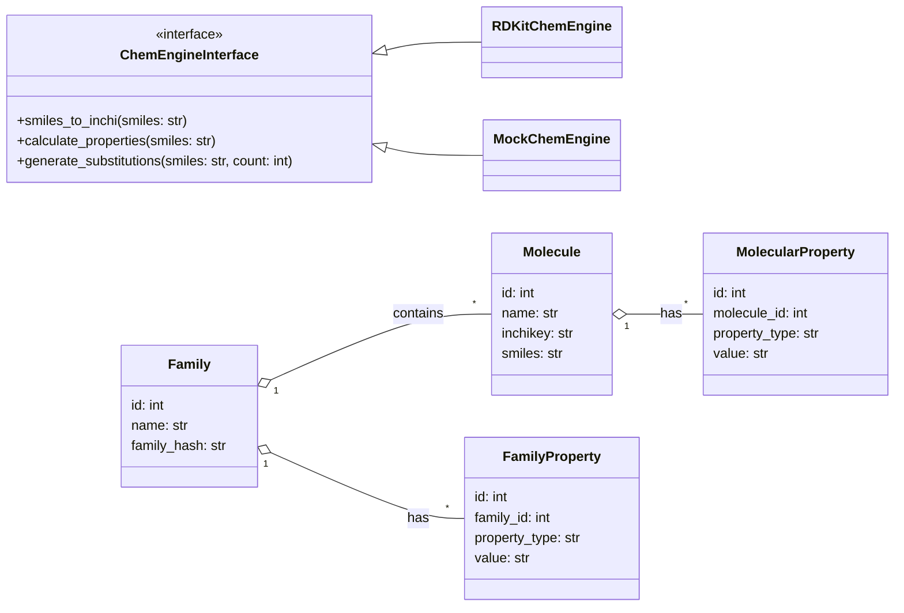
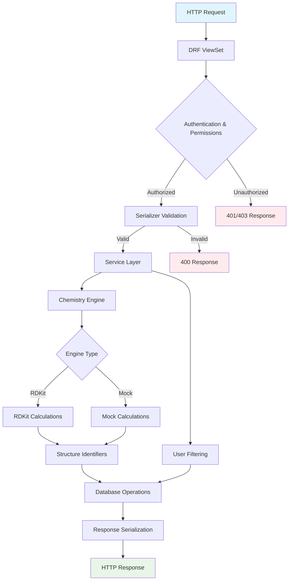

# Chemistry Module

El módulo Chemistry implementa un sistema completo de gestión de moléculas y familias químicas con arquitectura hexagonal, tipado fuerte y principios SOLID.

## 📋 Tabla de Contenidos

- [Arquitectura](#️-arquitectura)
- [Diagramas](#-diagramas)
- [Configuración](#️-configuración)
- [Modelos de Datos](#️-modelos-de-datos)
- [Endpoints API](#-endpoints-api)
- [Uso desde Otros Módulos](#-uso-desde-otros-módulos)
- [Tipos de Datos](#-tipos-de-datos)
- [Proveedores](#-proveedores)
- [Testing](#-testing)

## 🏗️ Arquitectura

El módulo sigue arquitectura hexagonal con separación clara de responsabilidades:

```text
chemistry/
├── types.py           # Tipos centralizados (dataclasses, TypedDict)
├── providers/         # Adaptadores para motores químicos
│   ├── interface.py   # Interfaz común
│   ├── rdkit_chem.py  # Implementación RDKit
│   └── mock_chem.py   # Mock para testing
├── services.py        # Lógica de dominio/aplicación
├── views.py          # Adaptadores HTTP (DRF ViewSets)
├── serializers.py    # Validación y transformación de datos
├── models.py         # Entidades de persistencia
└── README.md         # Este archivo
```

### Principios Aplicados

- **SRP (Single Responsibility)**: Cada módulo tiene una responsabilidad específica
- **OCP (Open/Closed)**: Extensible vía nuevos providers sin modificar código existente
- **DIP (Dependency Inversion)**: Dependencias hacia abstracciones (interfaces)
- **Hexagonal**: Lógica de negocio independiente de frameworks externos

## 📊 Diagramas

### Diagrama de Clases



### Diagrama de Flujo de Funcionamiento



## ⚙️ Configuración

### Variables de Entorno

```python
# settings.py
CHEM_ENGINE = os.environ.get('CHEM_ENGINE', 'rdkit')  # 'rdkit' o 'mock'
```

### Selección de Motor Químico

El sistema selecciona automáticamente el motor apropiado:

```python
# chemistry/providers/__init__.py
if CHEM_ENGINE == "mock":
    from .mock_chem import mock_engine as engine
else:
    try:
        from .rdkit_chem import engine
    except ImportError:
        from .mock_chem import mock_engine as engine
```

## 🗄️ Modelos de Datos

### Molecule

Entidad molecular con identificadores invariantes y metadatos flexibles.

**Campos clave:**

- `inchikey`: Identificador único (27 caracteres)
- `smiles`, `canonical_smiles`: Notaciones estructurales
- `molecular_formula`: Fórmula química
- `metadata`: Datos flexibles (JSON)

### Family

Agregación de moléculas relacionadas.

**Campos clave:**

- `family_hash`: Hash único basado en SMILES de miembros
- `provenance`: Origen de la familia (user, substitutions, etc.)
- `frozen`: Estado inmutable

### MolecularProperty / FamilyProperty

Modelo EAV (Entity-Attribute-Value) para propiedades flexibles.

**Campos contextuales:**

- `method`: Método de cálculo/determinación
- `units`: Unidades de medida
- `source_id`: Referencia externa
- `relation`: Tipo de relación con la entidad

## 🔐 Ownership y deduplicación (comportamiento esperado)

- Identificador primario interno: cada `Molecule` tiene un `id` entero (PK) usado por el sistema.
- Identificador químico único: la combinación canónica (`canonical_smiles` / `inchikey`) representa la identidad química global.
- Requisito funcional: dos usuarios pueden "poseer" la misma molécula química (mismo `inchikey`) pero deben poder añadir propiedades propias sin interferir entre sí.

Patrón recomendado (seguro y escalable):

1. Entidad canonical `Molecule` (única por `inchikey`).
2. Tabla intermedia `MoleculeOwnership` (o `UserMolecule`) que vincula `user ↔ molecule`. Esta tabla registra la pertenencia, permisos y metadatos de usuario (notas, tags, favorito, etc.).
3. Propiedades (`MolecularProperty` / `FamilyProperty`) apuntan a `Molecule` y contienen `created_by` y audit fields:
   - Si una propiedad es personal, `created_by = user` y puede ser filtrada por `?mine=true`.
   - Si se quiere una propiedad compartida/global, `created_by` puede ser el sistema o un usuario con permisos de publicar.

Comportamiento típico:

- Al crear desde SMILES: el servicio intenta buscar `Molecule` por `inchikey`.
  - Si existe: crea o actualiza una `MoleculeOwnership` para el usuario (no clona la molécula).
  - Si no existe: crea `Molecule` + `MoleculeOwnership`.
- Al listar `/api/chemistry/molecules/mine/`: devuelve `Molecule` JOIN `MoleculeOwnership` WHERE ownership.user = current_user.
- Al añadir propiedad: la API crea `MolecularProperty` con `molecule_id` (referencia a la `Molecule` canonical) y `created_by = current_user`. Así distintos usuarios pueden tener properties distintas sobre la misma `Molecule`.

Modelo de ejemplo (simplificado):

```python
from django.db import models
from django.conf import settings

class Molecule(models.Model):
  name = models.CharField(max_length=255)
  canonical_smiles = models.TextField(unique=True)
  inchikey = models.CharField(max_length=255, unique=True)
  # campos adicionales...

class MoleculeOwnership(models.Model):
  user = models.ForeignKey(settings.AUTH_USER_MODEL, on_delete=models.CASCADE)
  molecule = models.ForeignKey(Molecule, on_delete=models.CASCADE, related_name="owners")
  nickname = models.CharField(max_length=255, blank=True)   # nombre local del usuario
  notes = models.TextField(blank=True)
  is_favorite = models.BooleanField(default=False)

  class Meta:
    unique_together = ("user", "molecule")
```

Servicio de utilidad (patrón):

```python
def get_or_create_molecule_for_user(smiles: str, user, **molecule_kwargs):
  # 1) obtener identificadores (smiles -> inchi/inchikey) vía engine
  ids = engine.smiles_to_inchi(smiles)
  inchikey = ids.inchikey

  # 2) buscar molecule canonical
  molecule, created = Molecule.objects.get_or_create(
    inchikey=inchikey,
    defaults={**molecule_kwargs, "canonical_smiles": ids.canonical_smiles},
  )

  # 3) asegurar ownership
  MoleculeOwnership.objects.get_or_create(user=user, molecule=molecule)

  return molecule
```

Ventajas del patrón:

- Evita duplicación de moléculas en DB.
- Permite propiedades personales por usuario sin duplicar la entidad química.
- Facilita búsquedas globales por `inchikey` y el reuso de cálculos costosos.
- Mantiene historial/auditoría por `created_by` en propiedades.

Consideraciones:

- Si quieres que un usuario tenga una copia totalmente independiente (p. ej. editar estructura): ofrecer “fork” que duplica `Molecule` (marca `forked_from`) — esto complica búsquedas y agregados, úsalo sólo si realmente necesario.
- Las APIs deben exponer claramente: `/mine/` (basado en ownership) y endpoints globales (lectura pública según permisos).

## 🌐 Endpoints API

### Moléculas

| Método    | Endpoint                                      | Descripción           |
| --------- | --------------------------------------------- | --------------------- |
| GET       | `/api/chemistry/molecules/`                   | Listar moléculas      |
| POST      | `/api/chemistry/molecules/`                   | Crear molécula        |
| GET       | `/api/chemistry/molecules/{id}/`              | Obtener molécula      |
| PUT/PATCH | `/api/chemistry/molecules/{id}/`              | Actualizar molécula   |
| DELETE    | `/api/chemistry/molecules/{id}/`              | Eliminar molécula     |
| GET       | `/api/chemistry/molecules/mine/`              | Moléculas del usuario |
| POST      | `/api/chemistry/molecules/from_smiles/`       | Crear desde SMILES    |
| POST      | `/api/chemistry/molecules/{id}/add_property/` | Agregar propiedad     |

#### Ejemplo: Crear molécula desde SMILES

```bash
curl -X POST /api/chemistry/molecules/from_smiles/ \
  -H "Content-Type: application/json" \
  -H "Authorization: Bearer <token>" \
  -d '{
    "smiles": "CCO",
    "name": "Etanol",
    "extra_metadata": {"common_name": "ethanol"}
  }'
```

**Respuesta:**

```json
{
  "id": 1,
  "name": "Etanol",
  "smiles": "CCO",
  "canonical_smiles": "CCO",
  "inchikey": "LFQSCWFLJHTTHZ-UHFFFAOYSA-N",
  "molecular_formula": "C2H6O",
  "structure_identifiers": {
    "inchi": "InChI=1S/C2H6O/c1-2-3/h3H,2H2,1H3",
    "inchikey": "LFQSCWFLJHTTHZ-UHFFFAOYSA-N",
    "canonical_smiles": "CCO",
    "molecular_formula": "C2H6O"
  },
  "computed_properties": {
    "MolWt": 46.07,
    "LogP": -0.31,
    "TPSA": 20.23
  }
}
```

### Familias

| Método    | Endpoint                                         | Descripción                 |
| --------- | ------------------------------------------------ | --------------------------- |
| GET       | `/api/chemistry/families/`                       | Listar familias             |
| POST      | `/api/chemistry/families/`                       | Crear familia               |
| GET       | `/api/chemistry/families/{id}/`                  | Obtener familia             |
| PUT/PATCH | `/api/chemistry/families/{id}/`                  | Actualizar familia          |
| DELETE    | `/api/chemistry/families/{id}/`                  | Eliminar familia            |
| GET       | `/api/chemistry/families/mine/`                  | Familias del usuario        |
| POST      | `/api/chemistry/families/from_smiles/`           | Crear desde lista SMILES    |
| POST      | `/api/chemistry/families/{id}/generate_admetsa/` | Generar propiedades ADMETSA |
| POST      | `/api/chemistry/families/{id}/add_property/`     | Agregar propiedad           |

#### Ejemplo: Crear familia desde SMILES

```bash
curl -X POST /api/chemistry/families/from_smiles/ \
  -H "Content-Type: application/json" \
  -H "Authorization: Bearer <token>" \
  -d '{
    "name": "Alcoholes simples",
    "smiles_list": ["CO", "CCO", "CCCO"],
    "provenance": "user_collection"
  }'
```

#### Ejemplo: Generar propiedades ADMETSA

```bash
curl -X POST /api/chemistry/families/1/generate_admetsa/ \
  -H "Authorization: Bearer <token>"
```

**Respuesta:**

```json
{
  "family_id": 1,
  "properties_created": 18,
  "properties": {
    "MolWt": [46.07, 32.04, 60.1],
    "LogP": [-0.31, -0.77, 0.25],
    "TPSA": [20.23, 20.23, 20.23]
  }
}
```

### Propiedades

| Método | Endpoint                               | Descripción                    |
| ------ | -------------------------------------- | ------------------------------ |
| GET    | `/api/chemistry/molecular-properties/` | Listar propiedades moleculares |
| POST   | `/api/chemistry/molecular-properties/` | Crear propiedad molecular      |
| GET    | `/api/chemistry/family-properties/`    | Listar propiedades de familias |
| POST   | `/api/chemistry/family-properties/`    | Crear propiedad de familia     |

#### Ejemplo: Crear propiedad molecular

```bash
curl -X POST /api/chemistry/molecular-properties/ \
  -H "Content-Type: application/json" \
  -H "Authorization: Bearer <token>" \
  -d '{
    "molecule": 1,
    "property_type": "Solubility",
    "value": "miscible",
    "units": "g/L",
    "method": "experimental",
    "source_id": "pubchem:702"
  }'
```

## � Sistema de Propiedades con Unicidad Compuesta

### Llave Primaria Compuesta

Las propiedades moleculares y de familia utilizan un sistema de **unicidad compuesta** basado en 5 campos:

```
(entity, property_type, method, relation, source_id)
```

Donde:
- **entity**: `molecule` o `family` (referencia a la entidad padre)
- **property_type**: Tipo de propiedad (ej. "MolWt", "LogP", "Solubility")
- **method**: Método de obtención/cálculo (ej. "rdkit", "experimental", "predicted_qsar")
- **relation**: Contexto/relación (ej. "atom:12", "conformer:3", "aggregated:mean", "")
- **source_id**: Identificador de la fuente (ej. "pubchem:CID12345", "doi:10.xxx", "flow_run:uuid")

### Significado de los Campos

#### `property_type`
Identifica QUÉ propiedad se está midiendo/calculando.
- Ejemplos: "MolWt", "LogP", "TPSA", "Solubility", "pKa", "BindingAffinity"

#### `method`
Identifica CÓMO se obtuvo el valor.
- Ejemplos: "rdkit", "experimental_lcms", "predicted_qsar", "dft_b3lyp", "manual"
- Permite distinguir valores de la misma propiedad obtenidos por diferentes métodos

#### `relation`
Identifica A QUÉ PARTE o CONTEXTO de la entidad se refiere el valor.
- `""` (vacío): aplica a la molécula/familia completa (scope global)
- `"atom:12"`: valor específico del átomo en posición 12
- `"fragment:benzene"`: valor para un fragmento molecular
- `"conformer:3"`: valor para el conformador 3
- `"aggregated:mean"`: valor agregado (media) de múltiples mediciones
- `"replicate:2"`: segunda réplica experimental
- Este campo fue diseñado para identificar **qué flujo o proceso generó la propiedad**

#### `source_id`
Identifica DE DÓNDE proviene el dato (trazabilidad/provenance).
- `""` (vacío): sin trazabilidad externa
- `"pubchem:CID12345"`: dato importado de PubChem
- `"doi:10.1000/xyz"`: dato de publicación científica
- `"flow_run:7f6a-uuid"`: dato generado por ejecución de flujo
- `"experiment:LCMS_2025_10_24"`: dato experimental

### Reglas de Negocio

#### 1. Creación vs Actualización

**Al intentar crear** una propiedad con una llave compuesta existente:
- ❌ La creación **falla** con error `400 Bad Request`
- 💡 El sistema sugiere usar `PATCH` o `PUT` para actualizar

```python
# Ejemplo: Primera creación (éxito)
POST /api/chemistry/molecular-properties/
{
  "molecule": 8,
  "property_type": "LogP",
  "value": "2.5",
  "method": "rdkit",
  "relation": "",
  "source_id": "flow_run:abc123"
}
→ 201 Created

# Intento de duplicar (falla)
POST /api/chemistry/molecular-properties/
{
  "molecule": 8,
  "property_type": "LogP",
  "value": "2.7",  # ← valor diferente
  "method": "rdkit",
  "relation": "",
  "source_id": "flow_run:abc123"
}
→ 400 Bad Request
{
  "error": "Property already exists: property_type='LogP', method='rdkit', relation='', source_id='flow_run:abc123'. Use PATCH or PUT to update existing properties.",
  "property_type": "LogP",
  "method": "rdkit",
  "relation": "",
  "source_id": "flow_run:abc123"
}

# Actualización correcta
PATCH /api/chemistry/molecular-properties/{id}/
{
  "value": "2.7"
}
→ 200 OK
```

#### 2. Propiedades Invariantes (`is_invariant=True`)

Cuando `is_invariant` se marca como `True`:
- ✅ El campo `metadata` **siempre puede actualizarse**
- ❌ El campo `value` **NO puede modificarse**
- ✅ Los campos `units`, `method`, `relation`, `source_id` **NO pueden modificarse**

```python
# Crear propiedad invariante
POST /api/chemistry/molecular-properties/
{
  "molecule": 8,
  "property_type": "InChIKey",
  "value": "LFQSCWFLJHTTHZ-UHFFFAOYSA-N",
  "is_invariant": true,
  "method": "rdkit",
  "metadata": {"computed_at": "2025-10-24"}
}
→ 201 Created

# Intento de modificar valor (falla)
PATCH /api/chemistry/molecular-properties/{id}/
{
  "value": "DIFFERENT-INCHIKEY"
}
→ 400 Bad Request
{
  "error": "Cannot modify value of invariant property (id=123). Invariant properties can only have their metadata updated."
}

# Actualizar metadata (éxito)
PATCH /api/chemistry/molecular-properties/{id}/
{
  "metadata": {"computed_at": "2025-10-24", "verified": true}
}
→ 200 OK
```

#### 3. Múltiples Propiedades del Mismo Tipo

**Puedes tener múltiples propiedades del mismo `property_type`** si difieren en `method`, `relation` o `source_id`:

```python
# LogP calculado con RDKit
POST /api/chemistry/molecular-properties/
{
  "molecule": 8,
  "property_type": "LogP",
  "value": "2.5",
  "method": "rdkit",
  "source_id": ""
}

# LogP experimental
POST /api/chemistry/molecular-properties/
{
  "molecule": 8,
  "property_type": "LogP",
  "value": "2.3",
  "method": "experimental",
  "source_id": "pubchem:CID702"
}

# LogP predicho por QSAR
POST /api/chemistry/molecular-properties/
{
  "molecule": 8,
  "property_type": "LogP",
  "value": "2.6",
  "method": "qsar_model_v3",
  "source_id": "internal_model:v3.2"
}

# ✅ Las 3 propiedades coexisten porque tienen diferentes method/source_id
```

### Flujo de Trabajo Recomendado

#### Para Scripts/Procesos Automatizados

Usa el servicio `create_or_update_molecular_property` o `create_or_update_family_property`:

```python
from chemistry.services.properties import create_or_update_molecular_property

# Modo idempotente: crea o actualiza según exista
prop, created = create_or_update_molecular_property(
    molecule=molecule_instance,
    property_type="LogP",
    value="2.5",
    method="rdkit",
    relation="",
    source_id=f"flow_run:{run_id}",
    units="",
    metadata={"timestamp": "2025-10-24T10:00:00Z"},
    created_by=user,
    force_create=False,  # Si True, lanza error en duplicado
)

if created:
    print("Propiedad creada")
else:
    print("Propiedad actualizada")
```

#### Para APIs REST

**Creación inicial:**
```bash
POST /api/chemistry/molecular-properties/
{
  "molecule": 8,
  "property_type": "Solubility",
  "value": "1.2",
  "units": "mg/mL",
  "method": "experimental",
  "relation": "",
  "source_id": "lab:experiment_20251024"
}
```

**Actualización:**
```bash
# Opción 1: PATCH (actualización parcial)
PATCH /api/chemistry/molecular-properties/{id}/
{
  "value": "1.5",
  "metadata": {"notes": "remeasured with better calibration"}
}

# Opción 2: PUT (actualización completa)
PUT /api/chemistry/molecular-properties/{id}/
{
  "molecule": 8,
  "property_type": "Solubility",
  "value": "1.5",
  "units": "mg/mL",
  "method": "experimental",
  "relation": "",
  "source_id": "lab:experiment_20251024",
  "metadata": {"notes": "remeasured"}
}
```

### Validación en el Código

El sistema implementa validación en **3 capas**:

1. **Modelo (Django)**: `UniqueConstraint` en la base de datos
   ```python
   class Meta:
       constraints = [
           models.UniqueConstraint(
               fields=["molecule", "property_type", "method", "relation", "source_id"],
               name="unique_molecular_property_key",
           )
       ]
   ```

2. **Servicio**: Funciones `create_or_update_*` con manejo explícito
   ```python
   from chemistry.services.properties import (
       create_or_update_molecular_property,
       PropertyAlreadyExistsError,
       InvariantPropertyError,
   )
   ```

3. **Serializer/View**: Validación antes de persistir
   - Los serializers validan unicidad en `create()`
   - Las views capturan excepciones y devuelven mensajes amigables

### Casos de Uso Comunes

#### 1. Importación desde Base de Datos Externa

```python
# Importar desde PubChem
prop, created = create_or_update_molecular_property(
    molecule=mol,
    property_type="MolWt",
    value="180.16",
    method="pubchem",
    source_id="pubchem:CID12345",
    units="g/mol",
    is_invariant=True,  # Dato de referencia, no modificable
    created_by=None,
)
```

#### 2. Propiedades Generadas por Flujos

```python
# Cada flujo marca sus propiedades con un source_id único
flow_run_id = "7f6a-uuid-flow-abc"

for molecule in molecules:
    prop, created = create_or_update_molecular_property(
        molecule=molecule,
        property_type="PredictedActivity",
        value=str(activity_score),
        method="ml_model_v2",
        relation="",  # El flujo se identifica en source_id
        source_id=f"flow_run:{flow_run_id}",
        metadata={"model_version": "2.1", "confidence": 0.95},
        created_by=user,
    )
```

#### 3. Propiedades por Átomo/Fragmento

```python
# Cargas parciales por átomo
for atom_idx in range(num_atoms):
    prop, created = create_or_update_molecular_property(
        molecule=mol,
        property_type="partial_charge",
        value=str(charges[atom_idx]),
        method="dft_b3lyp",
        relation=f"atom:{atom_idx}",  # ← Especifica el átomo
        source_id="qm_job:xyz123",
        units="e",
        created_by=user,
    )
```

### Consultas Útiles

```python
# Obtener todas las propiedades de una molécula
props = MolecularProperty.objects.filter(molecule=mol)

# Filtrar por tipo
logp_props = MolecularProperty.objects.filter(
    molecule=mol,
    property_type="LogP"
)

# Filtrar por método
experimental_props = MolecularProperty.objects.filter(
    molecule=mol,
    method="experimental"
)

# Filtrar por fuente
pubchem_props = MolecularProperty.objects.filter(
    molecule=mol,
    source_id__startswith="pubchem:"
)

# Filtrar por relación (por ejemplo, propiedades atómicas)
atom_props = MolecularProperty.objects.filter(
    molecule=mol,
    relation__startswith="atom:"
)

# Obtener propiedad específica por llave compuesta
try:
    prop = MolecularProperty.objects.get(
        molecule=mol,
        property_type="LogP",
        method="rdkit",
        relation="",
        source_id=""
    )
except MolecularProperty.DoesNotExist:
    prop = None
```

### Migraciones

Al modificar el esquema de propiedades:

1. **Eliminar migraciones existentes** (excepto `__init__.py`):
   ```bash
   cd backend
   find chemistry/migrations -name "*.py" ! -name "__init__.py" -delete
   ```

2. **Regenerar migraciones**:
   ```bash
   python manage.py makemigrations chemistry
   ```

3. **Aplicar migraciones**:
   ```bash
   python manage.py migrate chemistry
   ```

## �🔧 Uso desde Otros Módulos

### Importar Servicios

```python
from chemistry import services as chem_services
from chemistry.services.properties import (
    create_or_update_molecular_property,
    create_or_update_family_property,
)
```

### Crear Molécula desde SMILES

```python
from chemistry.services import create_molecule_from_smiles

# Crear molécula
molecule = create_molecule_from_smiles(
    smiles="CCO",
    created_by=user,
    name="Etanol",
    extra_metadata={"source": "manual_input"}
)

print(f"Molécula creada: {molecule.name} (ID: {molecule.id})")
print(f"InChIKey: {molecule.inchikey}")
```

### Crear Familia desde Lista de SMILES

```python
from chemistry.services import create_family_from_smiles

# Crear familia
family = create_family_from_smiles(
    name="Alcoholes C1-C3",
    smiles_list=["CO", "CCO", "CCCO"],
    created_by=user,
    provenance="user_collection"
)

print(f"Familia creada: {family.name} con {family.members.count()} moléculas")
```

### Filtrar Moléculas por Usuario

```python
from chemistry.services import filter_molecules_for_user
from chemistry.models import Molecule

# Obtener moléculas del usuario
all_molecules = Molecule.objects.all()
user_molecules = filter_molecules_for_user(all_molecules, user)

print(f"El usuario tiene {user_molecules.count()} moléculas")
```

### Generar Propiedades ADMETSA

```python
from chemistry.services import generate_admetsa_for_family

# Generar propiedades ADMETSA para una familia
result = generate_admetsa_for_family(
    family_id=family.id,
    created_by=user
)

print(f"Propiedades creadas: {result['properties_created']}")
print(f"Moléculas procesadas: {result['molecules_processed']}")
```

### Usar Motor Químico Directamente

```python
from chemistry.providers import engine

# Obtener identificadores estructurales
try:
    identifiers = engine.smiles_to_inchi("CCO")
    print(f"InChI: {identifiers.inchi}")
    print(f"InChIKey: {identifiers.inchikey}")
    print(f"Fórmula: {identifiers.molecular_formula}")
except InvalidSmilesError as e:
    print(f"SMILES inválido: {e}")

# Calcular propiedades
try:
    properties = engine.calculate_properties("CCO")
    print(f"Peso molecular: {properties.mol_wt}")
    print(f"LogP: {properties.log_p}")
    print(f"TPSA: {properties.tpsa}")
except PropertyCalculationError as e:
    print(f"Error en cálculo: {e}")
```

## 📝 Tipos de Datos

### StructureIdentifiers

```python
@dataclass(frozen=True)
class StructureIdentifiers:
    inchi: str
    inchikey: str
    canonical_smiles: str
    molecular_formula: Optional[str] = None

    def to_dict(self) -> StructureIdentifiersDict: ...

    @classmethod
    def from_dict(cls, data: StructureIdentifiersDict) -> 'StructureIdentifiers': ...
```

### MolecularProperties

```python
@dataclass(frozen=True)
class MolecularProperties:
    mol_wt: Optional[float] = None
    log_p: Optional[float] = None
    tpsa: Optional[float] = None
    hba: Optional[float] = None
    hbd: Optional[float] = None
    rotatable_bonds: Optional[float] = None
    molar_refractivity: Optional[float] = None
    atom_count: Optional[float] = None
    ld50: Optional[float] = None
    mutagenicity: Optional[float] = None
    developmental_toxicity: Optional[float] = None
    synthetic_accessibility: Optional[float] = None

    def to_dict(self) -> MolecularPropertiesDict: ...

    @classmethod
    def from_dict(cls, data: MolecularPropertiesDict) -> 'MolecularProperties': ...
```

### SubstitutionResult

```python
@dataclass(frozen=True)
class SubstitutionResult:
    original_smiles: str
    substitutions: List[str]
    count: int

    def to_dict(self) -> dict: ...

    @classmethod
    def from_dict(cls, data: dict) -> 'SubstitutionResult': ...
```

## 🧪 Proveedores

### RDKit Provider

**Uso:** Producción y cálculos reales
**Requiere:** `rdkit-pypi` package

```python
# Activar RDKit
export CHEM_ENGINE=rdkit
```

**Capacidades:**

- Conversión SMILES → InChI/InChIKey reales
- Cálculo de propiedades fisicoquímicas precisas
- Generación de sustituciones básicas

### Mock Provider

**Uso:** Testing y desarrollo
**Requiere:** Ninguna dependencia externa

```python
# Activar Mock
export CHEM_ENGINE=mock
```

**Capacidades:**

- Conversiones determinísticas para testing
- Propiedades basadas en hash del SMILES
- Validación de SMILES inválidos (contienen "INVALID")

## ✅ Testing

### Ejecutar Tests

```bash
# Todos los tests
python manage.py test chemistry

# Tests específicos
python manage.py test chemistry.tests.test_models
python manage.py test chemistry.tests.test_services
python manage.py test chemistry.tests.test_views

# Con mock engine
CHEM_ENGINE=mock python manage.py test chemistry

# Con RDKit engine
CHEM_ENGINE=rdkit python manage.py test chemistry
```

### Cobertura de Tests

- **67 tests** total
- **Models:** Tests de entidades y relaciones
- **Services:** Tests de lógica de negocio
- **Views:** Tests de endpoints REST
- **Permissions:** Tests de autorizaciones
- **Integration:** Tests de flujos completos

### Estructura de Tests

```text
tests/
├── test_models.py           # Tests de modelos Django
├── test_services.py         # Tests de servicios de dominio
├── test_views.py           # Tests de vistas DRF
├── test_complete_crud.py   # Tests de integración CRUD
├── test_chemistry_mine.py  # Tests de filtrado por usuario
├── test_chemistry_permissions.py  # Tests de permisos
└── test_smoke.py           # Tests básicos de funcionalidad
```

## 🔗 Integración con Otros Módulos

### Módulo Users

```python
# Permisos requeridos
from users.permissions import HasAppPermission

# En views
permission_classes = [HasAppPermission]
permission_resource = "chemistry"
permission_action_map = {
    "create": "write",
    "update": "write",
    "partial_update": "write",
    "destroy": "delete",
    "list": "read",
    "retrieve": "read"
}
```

### Módulo Flows

```python
# Relación molécula-flujo via MoleculeFlow
from chemistry.models import MoleculeFlow

# Obtener moléculas de un flujo
flow_molecules = MoleculeFlow.objects.filter(flow=flow_id)
```

## 📚 Referencias

- **Estándares:** ChEMBL, PubChem
- **Arquitectura:** Hexagonal (Ports & Adapters)
- **Frameworks:** Django REST Framework, RDKit
- **Patrones:** Repository, Service Layer, Provider

---

**Versión:** 1.0  
**Fecha:** Octubre 2025  
**Mantenedor:** Equipo ChemFlow
